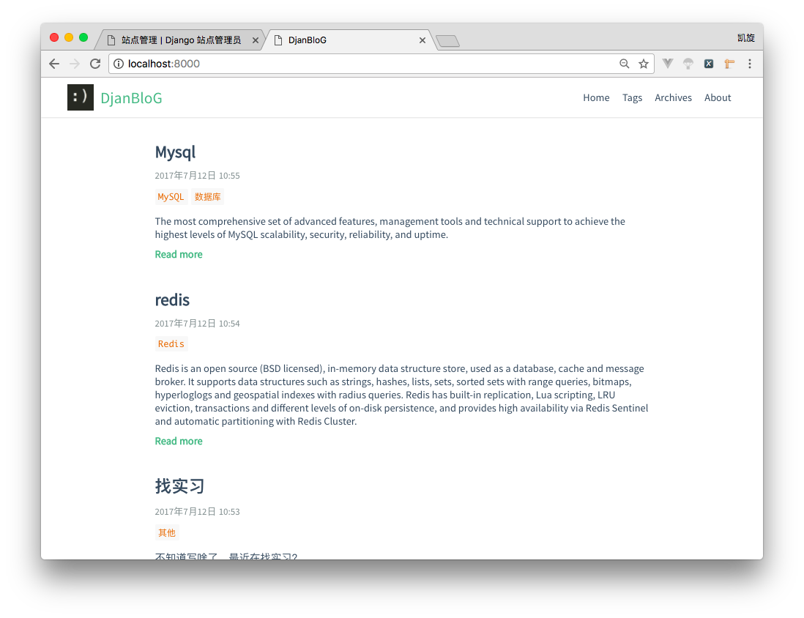
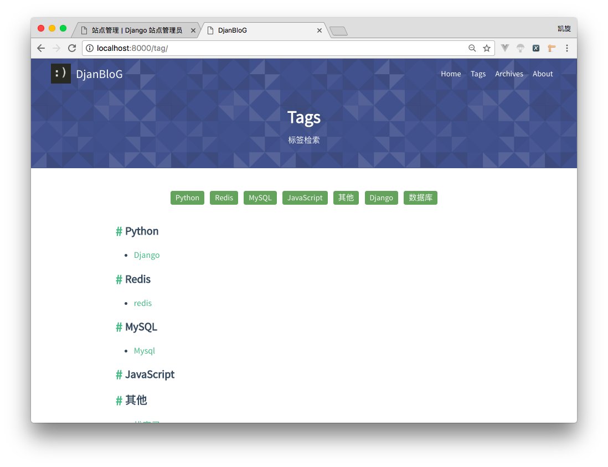
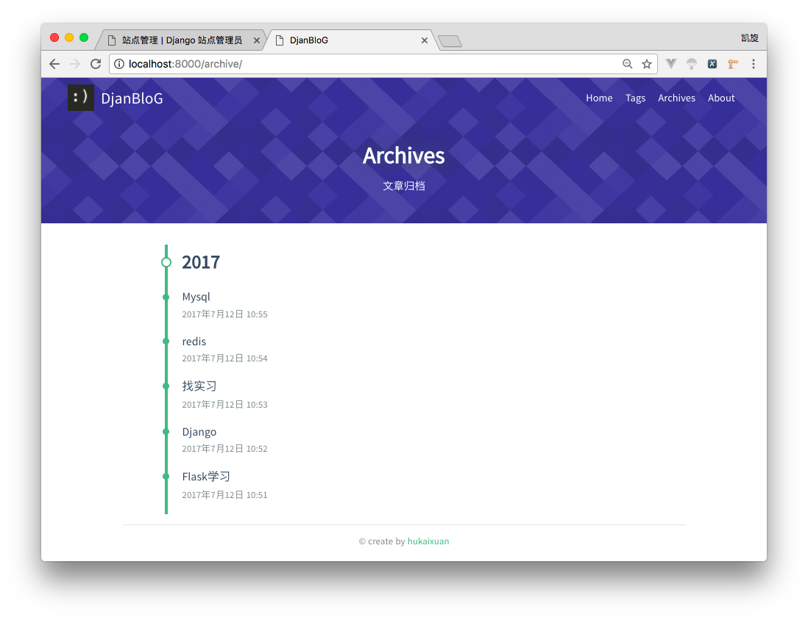
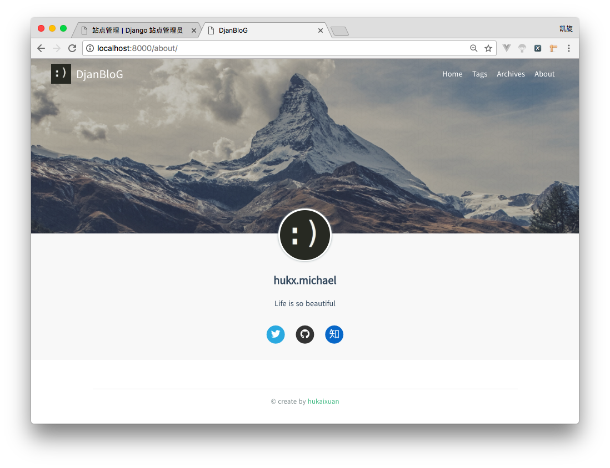

# DjanBloG
> a blog powered by django  🍰
 
---------------------------------------

### Install
- run `git clone https://github.com/hukaixuan/DjanBloG.git` get the project.
- `cd DjanBloG` and create a new virtual environment.
- run `pip install -r requirements.txt` to install the requirements.
- `python manage.py runserver` start the project and visit *http://127.0.0.1:8000/*. now you can see it!✌🏻
- visit *http://127.0.0.1:8000/admin* to admin the site.    
     username: admin
     password: hardtoguess
     
 
### Preview

